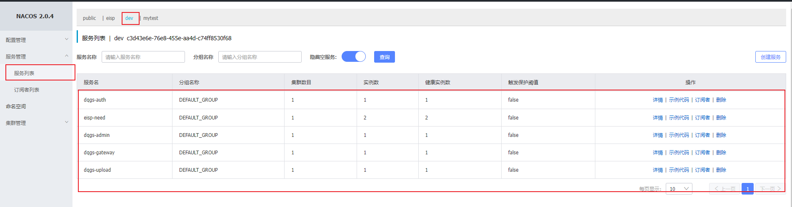
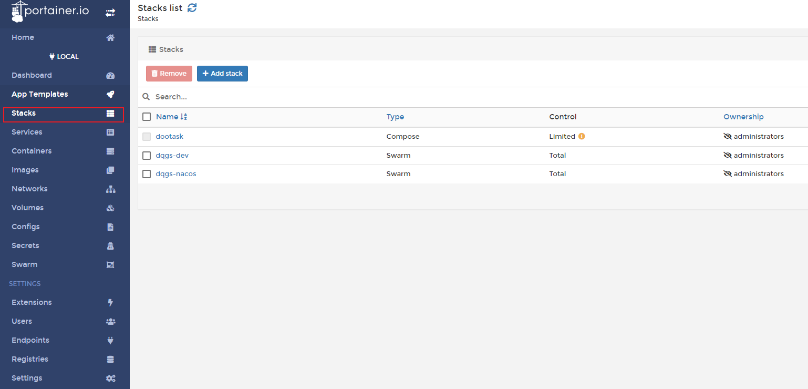
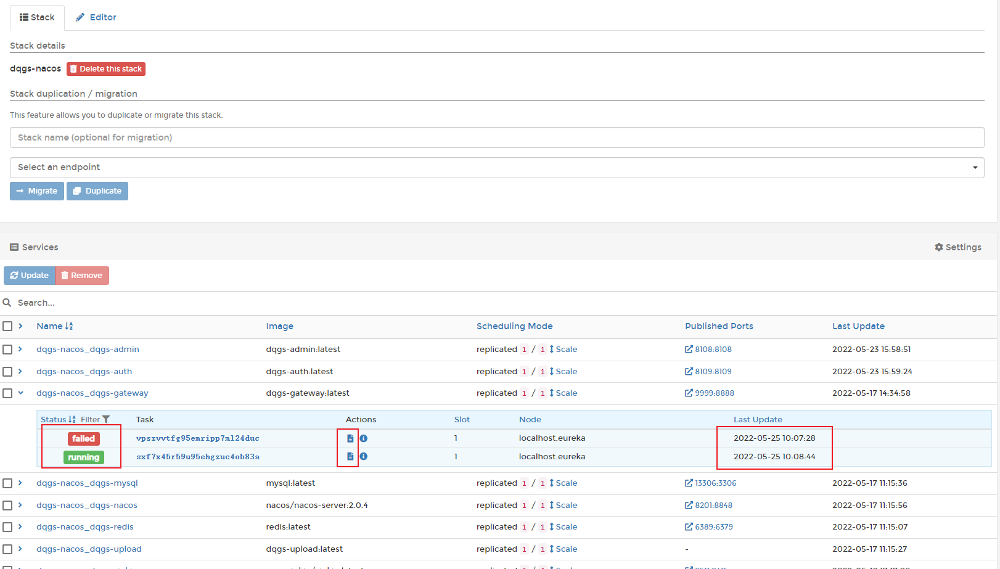
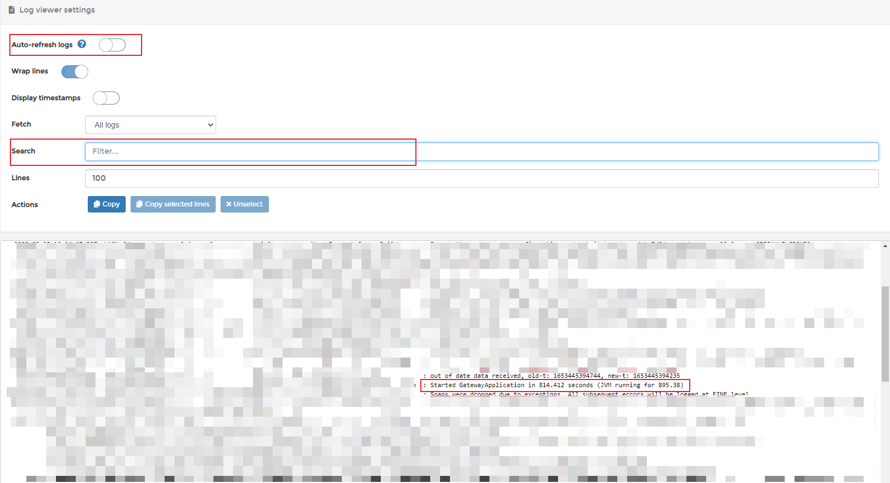

# 后端服务报错排查方式
## 先看注册中心
访问 http://192.168.1.17:8201/nacos 或 http://eureka:8201/nacos

先确认服务是否启起来



## 再看docker
访问 http://192.168.1.17:8001/ 或 http://eureka:8001/

点击进入当前页面，目前有两个 

dev 对应 8888 端口，macos 对应 9999 端口



点击 dqgs-macos 进来，可以看到所有的服务

服务如果出现问题，会自动重启，最多三次

若手动重启，勾选并点击 `Update` 按钮 

以网关 dqgs-gateway 为例，点击展开查看最近的运行记录

可以看到网关最近有启动失败的记录，我们可以点击日志详细查看



查看日志时，先关闭自动刷新

如果看到类似记录，则表明启动成功
```
Started GatewayApplication in 814.412 seconds (JVM running for 895.38)
```
或者也可以直接在搜索框查询



