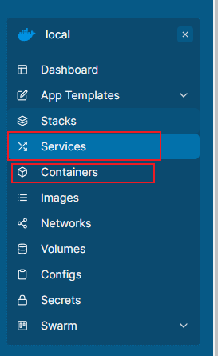

# 连接并启动 docker 中的容器
## 连接
### 用 ssh 连接服务器
```
ssh -p 端口号 账号@ip地址
```
### 查看 docker 是否启动
```
docker ps
```

### 启动 docker
```
systemctl restart docker
```

### 模糊查询所有 portainer 的容器 
```
docker ps -a | grep portainer
```

### 启动指定容器
```
docker start dqgs-portainer
```

## 集群部署和容器部署的区别
### 在 portainer.io 上的区别
在 Services 中显示的 web 就是通过集群部署的

重启方法就是选中然后 Update 就行

除了在 Services 中显示的 web 外

在 Containers 中显示的其他 web 都属于容器部署

重启方法就是选中然后 Restart 就行

