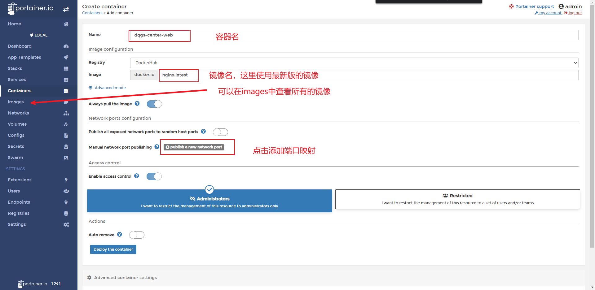
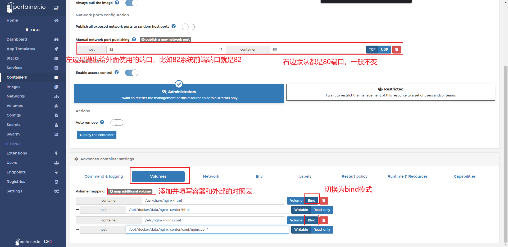
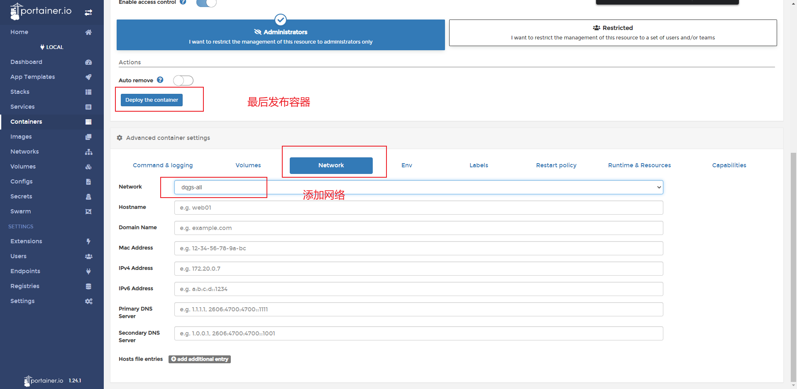

# 容器相关
## 创建容器
第一次弄的时候，后端给我的命令是这样的
```
docker run -d -p 82:80 --name dqgs-center-web --network dqgs-all -v /opt/docker/data/nginx-center/html:/usr/share/nginx/html -v /opt/docker/data/nginx-center/conf/nginx.conf:/etc/nginx/nginx.conf nginx:latest
```
对照 `portainer.io` 填入，如图所示




