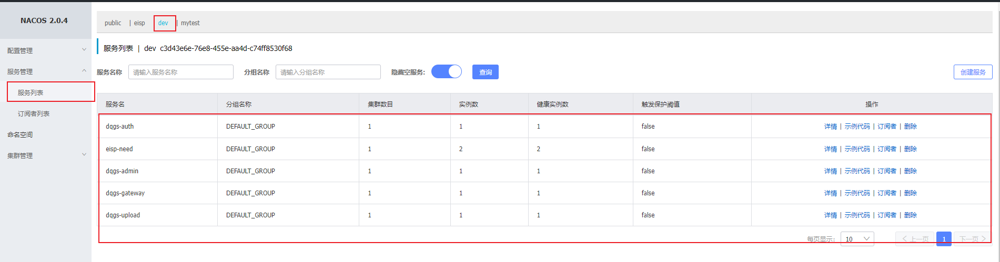
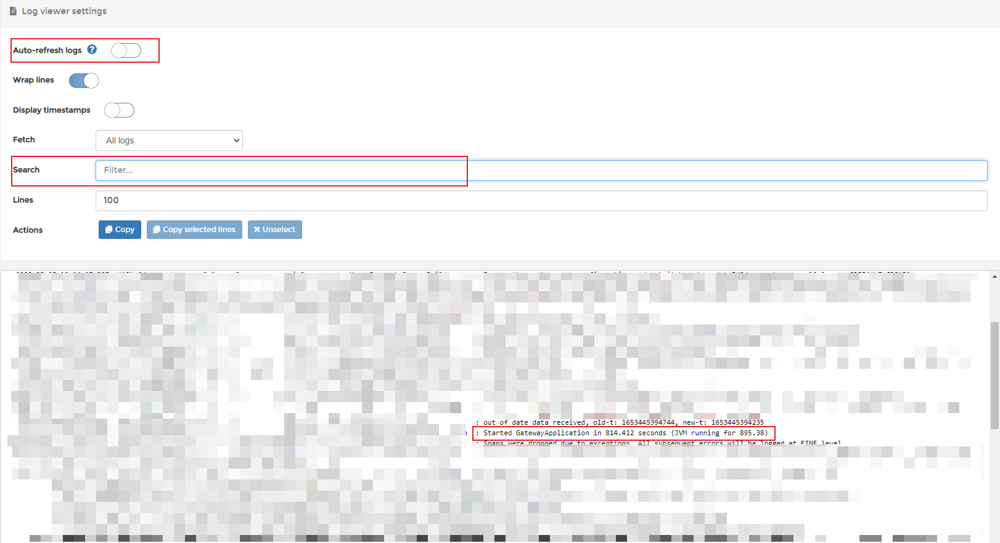

# 后端核心服务报错排查方式
## 先看注册中心
- 开发环境 访问 http://192.168.1.17:8201/nacos 或 http://eureka:8201/nacos 账号密码 epnc epnc_1024
- 测试环境 访问 http://192.168.1.18:8201/nacos 或 http://epnc18:8201/nacos 账号密码 epnc epnc_1024

先确认服务是否启起来

- 开发环境查看 `dev`
- 测试环境则是`test18`

`图中的这五个核心服务缺一不可`

如果有服务没有启动起来，则去 docker 找原因



## 再看docker
- 开发环境 访问 http://192.168.1.17:8001/ 或 http://eureka:8001/ 账号密码 admin dqgsepnc
- 测试环境 访问 http://192.168.1.18:8001/ 或 http://epnc18:8001/ 账号密码 epnc epnc_1024

点击菜单 `stacks` 进入 

- 开发环境 dev 对应 8888 端口，macos 对应 9999 端口（后续会慢慢舍弃 8888）
- 测试环境 `dqgs-nacos-test18`


点击 dqgs-macos 进来，可以看到所有的服务

服务如果出现问题，类似内存已满等情况，会自动重启，最多三次

若手动重启，勾选并点击 `Update` 按钮。

> [!TIP]
> 虽然重启可以解决大部分问题，但是非必要不重启，找到报错原因，也有可能是注册中心出现了问题

继续看，以网关 dqgs-gateway 为例，点击展开查看最近的运行记录

可以看到网关最近有启动失败的记录，我们可以点击日志详细查看


查看日志时，先关闭自动刷新

可以将展示行数 `Lines` 设置的多一些 100 行太少了

从日志最开始打印的地方`spring` logo下面开始看


如果看到类似记录，则表明启动成功
```
Started GatewayApplication in 814.412 seconds (JVM running for 895.38)
```
或者也可以直接在搜索框查询



> [!TIP]
> 遇到其他不确定的问题，请将日志截图给后端协助处理

