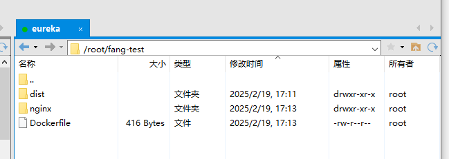

# 项目相关
## 前端不走飞流，直接打包镜像
### 前提工作
本地的dockerFile文件内容如下
```dockerfile
# Docker image for vue application
# VERSION 1.0.0
# Author: dream
 
### 基础镜像，使用nginx镜像
FROM registry.cn-zhangjiakou.aliyuncs.com/dqgs/epnc:nginx-alpine-2022
ENV TZ=Asia/Shanghai
#应用构建成功后的文件被复制到镜像内
COPY /dist /usr/share/nginx/html
COPY /nginx/nginx-meta.conf /etc/nginx/nginx.conf

#暴露8081端口
EXPOSE 8096
 
#作者
LABEL key="qincy@epnce.com"
```
1. 首先要服务器上有nginx基础镜像，17服务器上本身就有
2. 在服务器上建一个文件夹（因为docker build .命令会将文件夹内的所有内容全部打包进去）
3. 将打包好的dist文件夹和本地的nginx文件以及dockerfile文件本身一起放进去

4. 在文件夹下执行命令
```bash
[root@localhost fang-test]# docker build -t dqgs-admin-web:ads .
Sending build context to Docker daemon  20.23MB
Step 1/6 : FROM registry.cn-zhangjiakou.aliyuncs.com/dqgs/epnc:nginx-alpine-2022
 ---> 51696c87e77e
Step 2/6 : ENV TZ=Asia/Shanghai
 ---> Running in 0c5b4cb00738
Removing intermediate container 0c5b4cb00738
 ---> 4541737d6ee2
Step 3/6 : COPY /dist /usr/share/nginx/html
 ---> a09512c5a9fc
Step 4/6 : COPY /nginx/nginx-meta.conf /etc/nginx/nginx.conf
 ---> adf13e98d8e2
Step 5/6 : EXPOSE 8096
 ---> Running in 8cf48db40632
Removing intermediate container 8cf48db40632
 ---> d6c3faab6f12
Step 6/6 : LABEL key="qincy@epnce.com"
 ---> Running in 518ff7f15bb5
Removing intermediate container 518ff7f15bb5
 ---> dce76760ba86
Successfully built dce76760ba86
Successfully tagged dqgs-admin-web:ads

```
5. 运行镜像（经供参考）
```bash
[root@localhost fang-test]# docker run -d -p 28096:80 --name dqgs-admin-web-test-ads --network dqgs dqgs-admin-web:ads
```