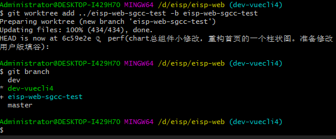

### 公司私有git 新建仓库注意事项

新建仓库时，设置为私有的，同时还要新建组织，将仓库和人员添加进组织

### GitHub 可以直接在网页开启代码编辑

在 对应的仓库主页点击按钮 `.`, 会进入一个 vscode 的编辑页面

### git clone 失败，文件太大

遇到过代码中有 3D建模的情况，clone 的时候报错

解决方法：只 clone 最新的 commit 
```
git clone  --depth=1 ssh://git@104.XXX.XXX.XXX:27681/home/git/warehouse/roysue.git
```

### 解决 github 访问慢的问题
[直接用里面的host就行，很方便](https://github.com/521xueweihan/GitHub520)

### github fork 其他人代码的全套流程

fork 别人的仓库到自己的仓库中，方便自己更改

如果别人的仓库更改了， 你想拉取更改，点击 Fetch upstream，然后 Fetch and merge

这样就把别人仓库的代码同步到你自己的远程仓库了，然后在本地 pull 拉去自己的远程仓库的最新改动

如果你想将自己的修改提交到别人的仓库中，合作开发

先 New pull request， 新建一个提交请求，可以对比你当前远程仓库和别人仓库的代码区别

新建之后，别人可以看到你的请求，如果别人觉得合适，采纳了，就可以在别人的仓库看到我们自己的提交记录了😊

### git worktree
```
git worktree add <新路径> -b <新分支名>
```
