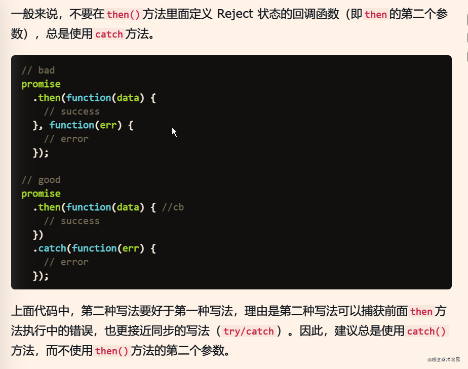

### 将扁平数组转化为树状结构
```js
const getTree = arr => {
    // 定义空的set，set类似于数组，但是具有唯一性
    const set = new Set()
    const res = []
    arr.forEach((v, i) => {
        // 基于key进行分类
        const key = v.comType
        const item = {
            label: v.comOwn,
            value: v.id
        }
        if(!set.has(key)){
            res.push({
                label: key,
                children: [item]
            })
            set.add(key)
        }else{
            // 获取到对应的key然后再push
            const t = res.find(v => v.label === key)
            t.children.push(item)
        }
    })
    return res
}
```
### Array.from 将维数组转换为真数组
```js
类似于 Array.from(document.querySelectorAll('.item.d2')) 

之后就可以使用正常的数组方法了，不用forEach了

Array.from还可以接受第二个参数，作用类似于数组的map方法，用来对每个元素进行处理，将处理后的值放入返回的数组

Array.from(arrayLike, x => x * x);

// 等同于
Array.from(arrayLike).map(x => x * x);

Array.from([1, 2, 3], (x) => x * x)
// [1, 4, 9]
```

### Array.of 用于生成一个数组对象，主要是用来弥补Array()的不足
```js
let res = Array.of(1, 2, 3)

console.log(res) // [1, 2, 3]
```

### 判断是数字
```js
const isNum = num =>  num !== '' && !isNaN(num)
```

### toLocaleString() 多国语言价格数字格式化
```js
(10000000).toLocaleString('en')
=》  10,000,000
```

### ~~ 运算符
[将变量转化为Number类型](https://blog.csdn.net/weixin_37710888/article/details/82587296) 同时可以用于向下取整

### 数组深拷贝
```js
// 简单的值类型数组深拷贝可以直接 解构 就行
const obj = [1, 2, 3, 4]
const copy = [...obj]
// const [...copy] = obj 这样也行

// 复杂的数组 比如 对象数组 可以这样深拷贝
const obj = [{a: 1, b: 2}, {a: 2, b: 3}]
const copy = obj.map(v => ({...v}))

//对于二维及以上的复杂数组，可以用 JSON 序列化与反序列化 来深拷贝
const obj = [1, [2, {aa: 2}, [4]], {aa: 5, cc: { dd: 6 }}]
const copy = JSON.parse(JSON.stringify(obj))
// 这种处理方式很方便,基本可以应对绝大部分情况，但是 有缺陷
// 1.拷贝的对象的值中如果有函数、undefined、symbol，则经过 JSON.stringify() 序列化后的 JSON 字符串中这个键值对会消失
// 2.无法拷贝不可枚举的属性，无法拷贝对象的原型链
// 3.拷贝 Date 引用类型会变成字符串
// 4.拷贝 RegExp 引用类型会变成空对象
// 5.对象中含有 NaN、Infinity 和 -Infinity，则序列化的结果会变成 null
// 6.无法拷贝对象的循环应用（即 objkey = obj）

// 最简单的还是使用 lodash 来处理
const copy = _.cloneDeep(obj)
```
[包括对象的深拷贝及其他详细内容](https://cloud.tencent.com/developer/article/1417051)

### 使你的网址在1分钟内提高1%
```js
<script src="//instant.page/5.1.0" type="module" integrity="sha384-by67kQnR+pyfy8yWP4kPO12fHKRLHZPfEsiSXR8u2IKcTdxD805MGUXBzVPnkLHw"></script>
```
引用自[https://instant.page/](https://instant.page/)

### 注册全局监听事件用 window.addEventListener()

### vue 全局注册事件竟然需要 this.$nextTick(() => {})
### 获取一张图片的实际尺寸
```js
用 dom 获取到的 clientWidth 和 clientHeight 都是字面意思，客户端尺寸。

想要获取一张图片的实际尺寸，要用 url 来获取

let img = new Image()

img.src = url //图片url

const width = img.width

const height = img.height

这样拿到的才是实际尺寸

但是这个在火狐和chrome上有区别，chrome无法点出img的属性，导致获取不到想要要的宽高？？？

可能和 两个浏览器的 window.onload 和 img.onload 的加载顺序有关
```

```js
console.time()

console.timeEnd()

可以用来打印代码执行时间
```

```
为什么在post请求前面会多一个options请求

因为这是处理跨域的一种方式，先去试探一下请求，如果成功（既运行跨域），则正常post请求
```

```js
可选链操作符 ?. 也可以处理函数

xxxx?.() => {}

当时困扰了很久
```

### package-lock.json
```
package-lock.json 文件是用来锁 package.json 里面依赖的版本的

在 npm5 以前没有这个文件的时候，你手动修改了 package.json 里面的依赖，然后在 npm install， 相对的依赖的版本就会直接被修改

有了 package-lock.json 之后，必须要 npm install xxx@x.x.x （@后面对应的版本号）去更新依赖，然后package-lock.json也能随之更新
```
> [!TIP] 团队开发时，当拉取代码，发现 package.json 和 package-lock.json 两个文件都更新了某一个依赖的版本时
> 
> 你必须 npm install 一下才能覆盖掉 node_modules 里面之前版本的这个依赖，这很重要

### 关于时间格式
```js
new Date( ).toLoacleDateString

=> 2021/4/23

快速获取时间戳

+ new Date()  或者  Date.now()

```
### 检测当前页面是否被隐藏
```js
document.addEventListener("visibilitychange", function() {
   console.log(document.hidden);
})

当切换页面时显示true， false就是打开状态, 一般在工作用主要用到用户在页面停留了多长时间
```

### addEventListener 和 removeEventListener

之前在实际项目中，涉及到在 vue 中进行事件的监听和销毁，

最开始写的时候，没有涉及到事件的销毁，所以都是使用箭头函数，在箭头函数内部进行判断

但是如果要清除监听，因为是匿名函数，所以直接就歇菜了
```js
document.addEventListener('DOMMouseScroll', this.cbScrollFirefox)

cbScrollFirefox(e) {
    console.log(e)
}

document.removeEventListener('DOMMouseScroll', this.cbScrollFirefox)
```
注意`上面的命名函数默认传参自己的 dom 本身` 这很重要。


### 箭头函数 不适合的情况
```js
对象字面量
{ name:'juejin', getName: () => this.name } 
// 我们是期望 this 指向方法的调用者即 object， 不合适！

DOM事件
button.addEventListener('click', () => { ... }) 
// 我们期望 this 指向 button， 不合适！

原型
String.prototype.customMethod = () => { ... } 
// 我们期望 this 指向 String 的实例， 不合适！

构造函数
const Person = () => {}, 则new Person(...) 
// 我们期望 this 指向 Person 的示例。不合适！
```
原因：

箭头函数 没有自己的 `this` 对象，它内部的 `this` 指向定义时上层作用域中的 `this`

无法使用 `bind`, `apply`, `call` 等手段改变箭头函数中的 `this` 指向

也就是说，箭头函数内部的 `this` 指向是固定的，相比之下，普通函数的 `this` 指向是可变的(动态的)。

上面四种情况箭头函数的上下文中的 this 都是 window。 

这四种情况如果都是用 function 就没问题，因为 function 中的 this 指向是动态的，始终指向 function 的调用者。
### arguments


### JSX @click.native

在项目中写 table 表格中的 下拉菜单 dropdown 时，因为用的是 jsx 的缘故，出现了问题

本身 dropdown 中的下拉选项的点击事件是用它自带的 command 的，这个在 jsx 中不好操作，根本触发不了事件

这个时候需要 用到 `.native`，为自定义组件添加原生事件(阻止事件冒泡)，在 jsx 中要这样写：

```js
<el nativeOnClick={this.nativeOnClickHandler} />
```

### JSX $notify message
```js
message: (
  <div onClick={this.handleClick}>
    这是一段文字
    <a target='_blank' href='https://www.jianshu.com/u/639201a5d397'>
      <el-button size="small" type="primary">查看详情</el-button>
    </a> 
  </div>
)
```

### let that = this

老生常谈的问题，`存储 this 指向`，之前在常规函数中见的比较多

也可以遍历 classList，做样式上的处理，也挺方便的

### 浏览器调试器查看事件监听

FF 上的直接在元素后面有个 `event` 的按钮

Chrome 上在右边可以点击查看所有的 事件

### 函数名和变量名前加下划线
只是一种规范
```
通常变量前加下划线表示 '私有变量'
函数名前加下划线表示 '私有函数'
```

### forEach

- `forEach` 是无法被终止的，就算你找到了对应的元素，也无法跳出循环，所以适合做纯遍历
- `forEach` 也不支持 `await` 
- 无法遍历原型链上的属性

```js
const arr = ['a', 'b', 'c'];
arr.prop = 'property value';

arr.forEach((elem, index) => {
  console.log(elem, index);
});
// Output:
// 'a', 0
// 'b', 1
// 'c', 2
```

### map
- `map` 和 `forEach` 这类的最大区别在于，`map` 有返回值，返回一个处理之后的不改变原数组的新数组。
- 正常情况下，`map` 和 `forEach` 都不改变原数组，但是 `forEach` 没有返回值
- map 是对数组的每一项 做操作，`map` 和 `forEach` 一样无法使用 `break` 中断循环，同时 `forEach` 还不能 使用 `return` 返回到外层函数

### for in

`for in` 用来循环数组不是一个合适的选择，更适合遍历对象

- 迭代的是数组实例上所有可枚举的属性key,而不是数组内元素
- 由于属性 key 是字符串，迭代出的元素索引是 string,不是 number
- 优势是可以迭代原型链上的键值

```js
const arr = ['a', 'b', 'c'];
arr.prop = 'property value';

for (const key in arr) {
  console.log(key);
}
// Output:
// '0'
// '1'
// '2'
// 'prop'
```

### for of

`for of` 很适合遍历数组

- 迭代所有数组元素
- `for of` 和 `for in` 的最大区别在于，通常情况下不经过处理的 `for of` 只能遍历到数组的 value，而 `for in` 只能遍历到数组的 key
- 内部支持 await，甚至是 ES2018 中引入的 for-await-of 语法
- 可以使用 `break` 和 `continue` 和 `return`

for of 的一个强大之处在于，可以遍历任何可迭代对象，例如 map

```js
const myMap = new Map()
  .set(false, 'no')
  .set(true, 'yes')
;
for (const [key, value] of myMap) {
  console.log(key, value);
}
// Output:
// false, 'no'
// true, 'yes'
```
同理，可以用 [key, value] 的形式遍历数组，拿到数组的key 和 value

```js
const arr = ['chocolate', 'vanilla', 'strawberry'];

for (const [index, value] of arr.entries()) {
  console.log(index, value);
}
// Output:
// 0, 'chocolate'
// 1, 'vanilla'
// 2, 'strawberry'
```
对于 `json` 对象可以使用  `Object.entries()` 方法返回一个给定对象自身可枚举属性的键值对数组,这个用的更多

### 创建一个指定长度的对象数组

```js
Array.from({length: 3},(v, i)=>({number: i + 1, kkk: i -1}))

[...Array(3)].map((v, i) => ({number: i + 1, kkk: i -1}))
```

### 基本类型（值）和复杂类型（引用）

1. 基本类型变量存的是值，复杂类型的变量存的是内存地址。
  
2. 基本类型在赋值的时候拷贝值，复杂类型在赋值的时候只拷贝地址，不拷贝值。


### !!

之前看到 !!变量名 这样的写法，意思是：

只要是 `undefind`, `null`, `''`, 全部取反
```js

if(a != null && typeof(a) != undefined && a != '') {

}
//等价于

if(!!a) {

}
```

### removeNode(el) 与 el.parentNode.removeChild(el)

删除当前 dom 节点的时候，为什么不直接删除，而是 `el.parentNode.removeChild(el)`，获取当前dom的父节点再删除当前父节点的子节点呢？

因为现代浏览器不支持 `removeNode(el)`，`removeNode` 只在 IE 浏览器下用

### 页面禁止复制

局部禁止复制可以直接加属性 `onselectstart="return false"` 实测，直接在控制台中删掉，好像也是不行的

其他方式可以看 [这里](https://www.cnblogs.com/war-hzl/p/4794698.html)

### try { } catch() {} 和 .then().catch() 和 promise(resolve, reject) 

.then() 是 Promise 的，专门用来处理异步的

而 resolve 和 reject 是 .then() 的两个函数，resolve 是必须，reject 可选，reject 等同于 .catch(), 因为 .catch() 内部调用的就是 reject

try{}catch() {} 和上面的最大不同在于 `专门用来捕获未知的系统错误或者请求错误`, 

未知的系统错误 我们懂，指出错之后可能会导致白屏，堆栈溢出,等用户体验很不好的页面错误， 或者后端是微服务，有多个不同模块的接口，一个服务出错导致其他未知错误的情况也有可能

那为什么说是`或者请求错误`呢？

因为 try catch 本身`不能捕获异步的错误，只能捕获同步异常`，它不是万能的，我们想捕获异步错误，一般都是在 .then()后面接 .catch()里面处理

如果一定要用 try catch 捕获异步请求中的错误，只能 用 async await 将异步变成同步了，这样我觉得是不太好的，只有本身是同步的请求，同时还要捕获请求中的异常的情况下，才需要这样做，否则是不建议用 try catch 来捕获请求中的异常的

还有一点需要注意
