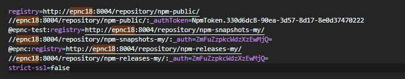
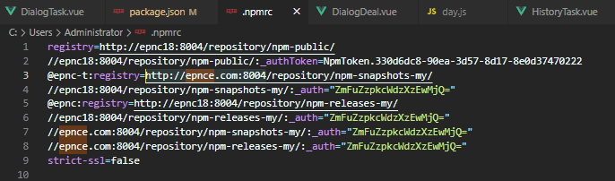

# nexus
## 配置私有的npm下载和publish地址
查看 .npmrc 文件位置
```
npm config get userconfig
```
.mpmrc 文件如下



加了@的是加了命名空间的registry，可以在你publish带@epnc或者@penc-test前缀的组件时，自动识别

跟在下面一行的是去掉http前缀的registry

然后冒号后面跟的是对应的registry的`账号:密码`的base64。可以在publish的时候免登录

给下面人用的时候，只需要第一行就行

tips: 补充一点

只要在 .npmrc 文件中配置了 `//url:端口/registry/xxx`这种形式的账号密码

就算你在外部去 `npm set registry xxx`,只要匹配上了，也可以做到免登录

所以就有了下面的 `package.json` 中的 `script` 写法 

第一步 我 publish 的时候，用的是 .npmrc 中的默认 registry

第二部 修改 registry 再 publish，这步的 registry 会被 .npmrc 中提前已经写好的账号密码识别

第三步 再修改回默认的 registry，最终不影响 .npmrc 文件本身

```json
// package.json
{
  "name": "@epnc-t/sm4",
  "version": "1.0.0-2023.02.01-6",
  "description": "sm4",
  "main": "index.js",
  "scripts": {
    "test": "echo \"Error: no test specified\" && exit 1",
    "pub-t": "npm publish && npm set @epnc-t:registry=http://epnce.com:8004/repository/npm-snapshots-my/ && npm publish && npm set @epnc-t:registry=http://epnc18:8004/repository/npm-snapshots-my/",
    "pub": "npm publish && npm set @epnc:registry=http://epnce.com:8004/repository/npm-releases-my/ && npm publish && npm set @epnc:registry=http://epnc18:8004/repository/npm-releases-my/"
  },
  "keywords": [],
  "author": "fang 903508229@qq.com",
  "license": "ISC",
  "files": [
    "index.js",
    "lib/*.js",
    "*.json"
  ]
}
```

## 旧版的npmrc文件
由于修改了epnce.com为ip，故保存一版旧的配置


## 关于切换 .npmrc 文件
全局下载 npmrc，它是一种 .npmrc管理工具，类似于 nvm.可以做到轻松切换 .npmrc 文件

也是一种解决不同registry的方式
```
npm install -g npmrc
```

## 常见错误及解决办法
### npm login need: BASIC realm="Sonatype Nexus Repository Manager"
解决办法：管理员配置 realm 权限就行