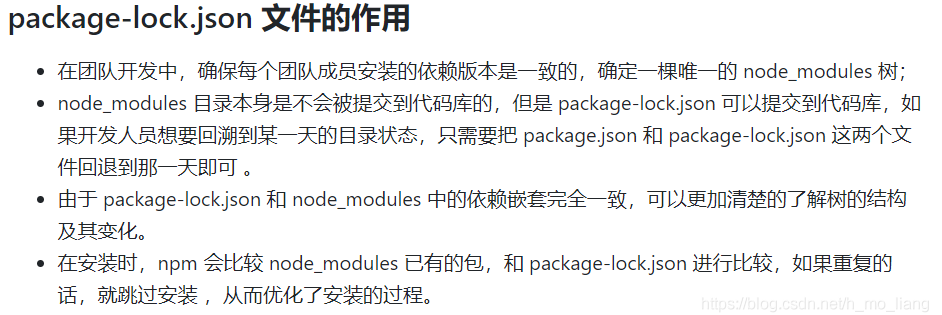

## package.json文件
[官方中文文档](http://javascript.ruanyifeng.com/nodejs/packagejson.html)

### peerDependencies 并行依赖
vue3 的 ui 组件 element-plus 中的 package.json 文件中这样写到
```json
{
    "peerDependencies": {
        "vue": "^3.2.0"
    }
}
```
[官方文档写的很详细](http://javascript.ruanyifeng.com/nodejs/packagejson.html)
`peerDependencies` 字段，就是用来供插件指定其所需要的主工具的版本。

```json
{
  "name": "chai-as-promised",
  "peerDependencies": {
    "chai": "1.x"
  }
}
```
上面代码指定，安装 `chai-as-promised` 模块时，主程序 `chai` 必须一起安装，而且 `chai` 的版本必须是 `1.x` 。如果你的项目指定的依赖是 `chai` 的 2.0 版本，就会报错。

### 


### ^和~的区别

- `^` 它将当前库的版本更新到第一个数字（major version)中的最新版本，比如：`^12.2.2`，库会匹配更新到`12.X.X`的最新版本，但是不会更新到`13.X.X`版本
- `~` 当下载的时候，它会自动更新到中间那个数字（minor version）的最新版本，比如：`~2.2.0`，库就会更新到`2.2.X`的最新版本，但是不会更新到`2.3.X`版本。波浪符号是曾经npm安装时候的默认符号，现在已经变为了插入符号


## vue版本无法锁定的问题
这三个依赖中的一个或者多个会导致在组件内部限制的vue版本在当前项目无法锁定vue版本？？？
```
"vue-class-component": "^7.2.6",
    "vue-json-excel": "^0.3.0",
    "vue-property-decorator": "^9.1.2",
```

那是当然的，主项目内依赖了多个组件中，如果这些组件内部都依赖了 vue 

这时候，在主项目本身中没有限制vue版本的情况下，且没有 lock 文件

install 下来的 vue 版本是未知的，优先最新的，最稳定的版本

当然，这违背了我们锁 vue 版的初衷

解决办法：

将所有依赖了 vue 的依赖，放在 common-vue 依赖中

或者 在主项目中锁定 vue 版本