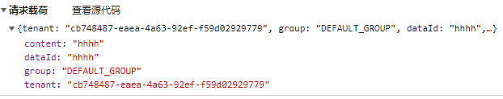
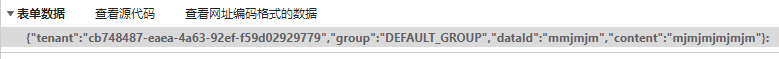
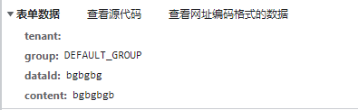

# axios
## 关于传参
### 不做任何处理的 data 参数


### 加了 headers: { "Content-Type": "application/x-www-form-urlencoded" } 的 data 参数


将整个 JSON 作为表单的第一项的`键名`来传递，一定要注意到最后面的`冒号`

### 用了 qs.stringify(data) 处理后的 data 参数


qs.stringify() 处理相当于将 对象格式转化为了表单形式，去掉了外部的括号，然后会被 axios 自动识别为

`"Content-Type": "application/x-www-form-urlencoded"` 形式
```js
const obj = {a: 1}
qs.stringify(obj) // 'a=1'

const string = 'a=1'
qs.parse(string) // '{a: '1'}'
```

> [!TIP]
> 造成以上结果的原因是：默认情况下，axios将JavaScript对象序列化为JSON也就是 `application/json;charset=UTF-8`
>
> 要以`application/x-www-form-urlencoded`格式发送数据
> 
> 最简单的方式就是使用 `qs.stringify()`了
>
> 这点[在官网上写的比较详细了](http://www.axios-js.com/zh-cn/docs/#%E4%BD%BF%E7%94%A8-application-x-www-form-urlencoded-format)

## 接收二进制数据流并下载
用 axios 的话只需修改请求头参数 `responseType` 为 `blob`，然后 a 链接下载
```js
// 基本模板，
const res = await ApiGetConfigs(params, "blob")
// 获取文件后缀 这里可以根据文件名后缀，写键值对来做动态文件类型的下载
// 这里附上blob类型大全 https://blog.csdn.net/yin_you_yu/article/details/116261304
// let suffix = response.headers['content-disposition'].search(/[^\.]\w*$/)
let blob = new Blob([res], { type: "application/zip" })
// 创建URL
let objectUrl = URL.createObjectURL(blob)
// 这里也可以获取并处理文件名
location.href = objectUrl
// 释放内存
URL.revokeObjectURL(objectUrl)
```

## 常见问题以及报错
### mockjs 会导致 axios 请求失败
mockjs 和 axios 同时存在的情况下，mockjs 会修改 axios 的 `responseType`

导致在上传文件和下载文件的时候 axios 直接报错，走响应拦截的错误拦截器