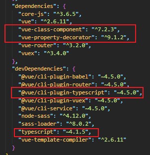

## hello typescript
### vue create 创建的带 ts 的 vue2.x 项目中的初始依赖。
```json
// pakage.json
{
  "name": "web-ts",
  "version": "0.1.0",
  "private": true,
  "scripts": {
    "serve": "vue-cli-service serve",
    "build": "vue-cli-service build"
  },
  "dependencies": {
    "core-js": "^3.6.5",
    "vue": "^2.6.11",
    "vue-class-component": "^7.2.3",
    "vue-property-decorator": "^9.1.2", /* 这个是装饰器，一定要配合上面的 vue-class-components 一起才能用 */
    "vue-router": "^3.2.0",
    "vuex": "^3.4.0"
  },
  "devDependencies": {
    "@vue/cli-plugin-babel": "~4.5.0",
    "@vue/cli-plugin-router": "~4.5.0",
    "@vue/cli-plugin-typescript": "~4.5.0",
    "@vue/cli-plugin-vuex": "~4.5.0",
    "@vue/cli-service": "~4.5.0",
    "node-sass": "^4.12.0",
    "sass-loader": "^8.0.2",
    "typescript": "~4.1.5",
    "vue-template-compiler": "^2.6.11"
  }
}
```
相比于 vue 的 js 项目，多了下面几个依赖



后续可以尝试，直接在 js 项目中安装对应的依赖，看看是不是同样的效果