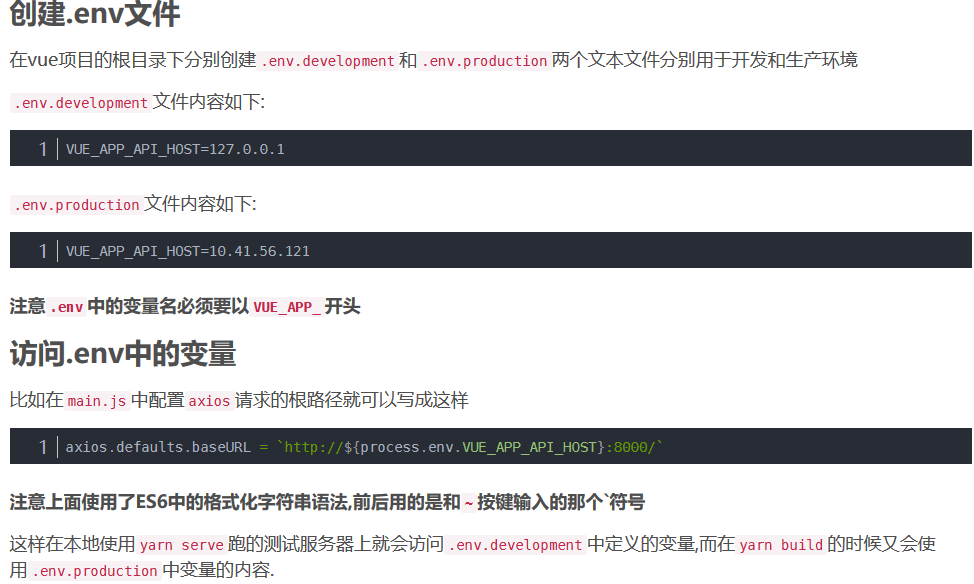

## 环境变量配置

### vue-cli 2.x

在`config`文件夹中的`prod.env.js`和`dev.env.js`文件中，写好变量

在`main.js`里面加上`Vue.prototype.baseURL = process.env.BASE_API`

这个`BASE_API`是你配的变量名称，因为是常量，所以用全大写

### vue-cli 3.x-



### 多环境打包配置
[这个是vuecli2的操作方式](https://www.cnblogs.com/dianzan/p/13151950.html)
详细的，可以查看天津项目的配置，就是按照这个来的

vuecli3 的多环境打包 很简单，只需要两步 

1. 在 pakage.json 的 scripts 中添加新的打包脚本命令,在后面加上 --mode xxx
```json
"scripts": {
    "serve": "vue-cli-service serve",
    "build": "vue-cli-service build",
    "buildOne": "vue-cli-service build --mode buildOne",
    "buildTwo": "vue-cli-service build --mode buildTwo"
}
```
2. 在项目中创建对应的 .env.xxx 的文件。
```
//.env.prodOne
NODE_ENV = 'production'

# 只是一个标识符
VUE_APP_NODE_ENV = 'prodOne'
```
> [!Danger]
> 注意：NODE_ENV 这个属性是给 node 用的，不能随意更改为标识符，想加标识符，需额外定义。如果是线上环境，NODE_ENV 统一都为 `production`.原因是 node 只能识别 NODE_ENV 为 `production` 时才在打包好的文件名中加上防止缓存的 `hash` 值

tips: 内部如果要新写变量，一定要 VUE_APP_ 开头，建议变量名称也用大写（常量）

> [!Danger]
> 在配置 .env 文件的时候，发现开发环境下的 .env 文件只能写成 .env.development。写成 .env.dev 无效，获取到的 process.env 是默认的 development 的，这点要注意

