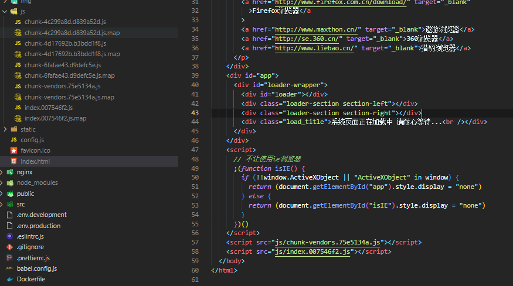
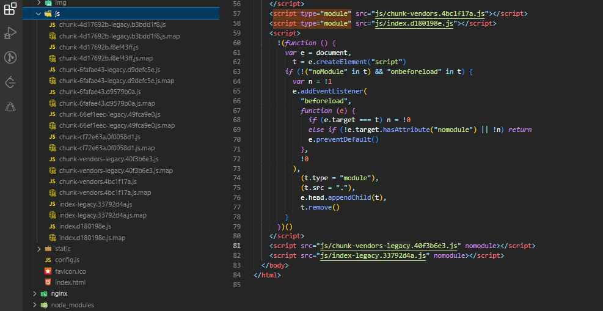

## vue.config.js

[首先看官网，写的已经是相当详细了](https://cli.vuejs.org/zh/config/#%E5%85%A8%E5%B1%80-cli-%E9%85%8D%E7%BD%AE)

## vueconfig.js 配置代理
```js
module.exports = {
    devServer: {
        proxy: {
            "/api": {
                // 代理的地址
                target: "http://my.com:8888",
                //允许跨域
                changeOrigin: true, 
                // 地址重写
                pathRewrite: {
                    // 将以 /api 开头的，替换为 '' 空
                    "^/api": ""
                }
            }
        }
    }
}
```
> [!WARNING]
> 注意：配置了上面的代理后，类似 /api/xxx/xxx 这样的接口地址 会被代理为 http://my.com:8888/xxx/xxx
> 
> 去掉了 /api，加上了代理地址 http://my.com:8888
> 
> 同时，请求被 dev-server拦截之后，浏览器是不会显示代理之后的 url 的，但是实际上是有效果的，这点很容易让人搞混淆
> 
> 但是这是 dev 模式下的代理，发布到远程后，还要在 nginx 配置文件上配置相同的代理才行😊


## sass 配置全局混入
之前用 sass 做主题切换的时候，涉及到要混入 sass 变量，具体如何混入，vue-cli2.x 和 vue-cli3.x 还是有区别的

1. 无论是 2.x 还是 3.x，都需要提前安装三个依赖
```json
"dependencies": {
  "node-sass": "^4.11.1",
  "sass-loader": "^7.3.0",
  "sass-resources-loader": "^1.3.3",
}
```
一般你选择 sass 新建的项目，都会帮你安装好，没有的就自己装

2. 如果是3.x 直接在 vue.config.js 文件中加上
```js
module.exports = {
    css: {
        sourceMap: true,
        loaderOptions: {
            sass: {
                //公共的scss变量和混入(可加多个，用 ；号分隔)
                prependData: `@import "./src/style/base"; 
                            @import "./src/style/primaryChange";`,
            }
        }
    }
}
```
如果是2.x 找到 build 文件夹中的 utils.js 文件，修改 sass 的配置
```js
// build/utils.js 中 修改scss的配置如下：
return {
    css: generateLoaders(),
    postcss: generateLoaders(),
    less: generateLoaders('less'),
    sass: generateLoaders('sass', { indentedSyntax: true }),
    scss: generateLoaders('sass').concat(
        {
            loader: 'sass-resources-loader',
            options: {
                resources: [
                    path.resolve(__dirname, '../src/styles/variables.scss'),
                    path.resolve(__dirname, '../src/styles/mixins.scss'),
                    path.resolve(__dirname, '../src/styles/primaryChange.scss')
                ]
            }
        }
    ),
    stylus: generateLoaders('stylus'),
    styl: generateLoaders('stylus')
}
// 详细 webpack 配置查看 https://vue-loader.vuejs.org/en/configurations/extract-css.html
```

3. 然后记得重启项目，就可以直接使用 你在 common.scss 文件中定义的全局变量了 如 `$hb-dark-theme-deep`, `$eisp-menu-bg`


## 配置打包分析工具 webpack-bundle-analyzer
### 安装依赖
```
npm install webpack-bundle-analyzer --save-dev
```

### webpack配置
```js
// vue.config.js
module.exports = {
    chainWebpack: config => {
        // 我们这里配置 只在生成环境下才分析，这里的判断可以自行修改
        config.when(process.env.NODE_ENV === 'production', config => {
            // 引入插件 并使用插件
            config.plugin('webpack-bundle-analyzer').use(require('webpack-bundle-analyzer').BundleAnalyzerPlugin)
        })
    }
}
```
### 脚本配置
```json
// pakage.json
"scripts": {
    "analyz": "NODE_ENV=production npm_config_report=true npm run build"
}
```

### 执行命令
```
npm run build
```
tips: 浏览器自动打开 http://127.0.0.1:8888，如果8888 端口被占用，则提示打包失败

### 入口文件 index.html 中根据环境变量配置
webpack 可以识别 `<%  %>` 这两个字符中的内容
```html
<head>
    <meta charset="utf-8">
    <meta name="viewport" content="width=device-width,initial-scale=1.0">
    <title><%= htmlWebpackPlugin.options.title %></title>
    <% if (process.env.VUE_APP_PRO_ENV === 'prodOne' ) { %>
      <link href="<%= htmlWebpackPlugin.files.publicPath %>static/loading/white.css" rel="stylesheet" />
    <% } else {%>
      <link href="/static/loading/default.css" rel="stylesheet" />
    <% } %>
  </head>
```

`htmlWebpackPlugin` 对象全部内容如下（默认的dev环境下）
```json
{
    "files": {
        "publicPath": "/",
        "chunks": {
            "chunk-vendors": {
                "size": 7449741,
                "entry": "/js/chunk-vendors.js",
                "hash": "e9397322efe5df049dc7",
                "css": []
            },
            "index": {
                "size": 804484,
                "entry": "/js/index.js",
                "hash": "d8c1f8d611fe47521b09",
                "css": []
            }
        },
        "js": [
            "/js/chunk-vendors.js",
            "/js/index.js"
        ],
        "css": []
    },
    "options": {
        "template": "D:\\eisp\\eisp-web\\node_modules\\_html-webpack-plugin@3.2.0@html-webpack-plugin\\lib\\loader.js!D:\\eisp\\eisp-web\\public\\index.html",
        "filename": "index.html",
        "hash": false,
        "inject": true,
        "compile": true,
        "favicon": false,
        "minify": false,
        "cache": true,
        "showErrors": true,
        "chunks": [
            "chunk-vendors",
            "chunk-common",
            "index"
        ],
        "excludeChunks": [],
        "chunksSortMode": "auto",
        "meta": {},
        "title": "天津市能源供需互动服务平台",
        "xhtml": false,
        "cdn": {
            "prefetch": [],
            "css": [],
            "js": []
        }
    }
}
```

## vueconfig.js 文件中配置 cdn 加速
### 为某个依赖配置 cdn 加速，以 echarts 为例
```js
// vueconfig.js
module.exports = {
  configureWebpack: {
    // 选择cdn加速的资源名称（import echarts from echarts）
    externals: {
      // echarts: 'echarts'
    }
  },

  pages: {
    index: {
      // cdn加速
      cdn: {
        prefetch: [],
        css: [],
        js: [
          // 'https://cdn.jsdelivr.net/npm/echarts@4.8.0/dist/echarts.js',
        ]
      }
    }
  }
}

```

## 打包后通过修改静态文件的内容来做到动态发布

1. public 中创建 config.js 文件
2. 直接在文件中创建变量
```js
// public/config.js
const staticConfig = {
  baseUrl: '/xxx'
}
```
3. 在 `index.html` 文件中引入
```html
<script src="/config.js"></script>
```  
4. 之后除了不能用在 `vue.config.js` 文件中，其他文件都是直接使用就行(后来发现，实际上在 vue.config.js 文件中根本不需要配置环境变量)
```js
console.log(staticConfig.baseUrl)
```
5. 这样就算打包发布到远程后，通过修改 `config.js` 文件就可以做到动态的影响内部所有使用变量的地方了


## 适配低版本浏览器
旧版本的微信自带的浏览器内核用的是很老的 chrome

代码打包后放在上面运行会对es6等新特性报错

解决方法：不用做多余的操作，只要在 `package.json`中配置一下就可解决
```json
// package.json
{
  "browserslist": [
    "> 1%",
    "last 2 versions"
  ]
}
```
理论上创建 `.browserslistrc` 文件也是可以的，但是可能会无效

[browserslist详细参数](https://segmentfault.com/a/1190000042212344?sort=newest)

>[!Danger]
> 上面写的有问题,配置了 browserslist 后，还要配合[transpileDependencies属性](https://blog.csdn.net/tglsaturn/article/details/117366008)一起

其实[官网](https://cli.vuejs.org/zh/guide/browser-compatibility.html)上讲的很详细了

这里介绍一下官网说的 `现代模式`

正常build



适配低版本浏览器的modern build




[vue-element-admin](https://panjiachen.gitee.io/vue-element-admin-site/zh/guide/other/faq.html#%E5%8A%A8%E6%80%81%E9%85%8D%E7%BD%AE%E8%B7%AF%E7%94%B1%E9%85%8D%E7%BD%AE)上也有对浏览器兼容的处理方式